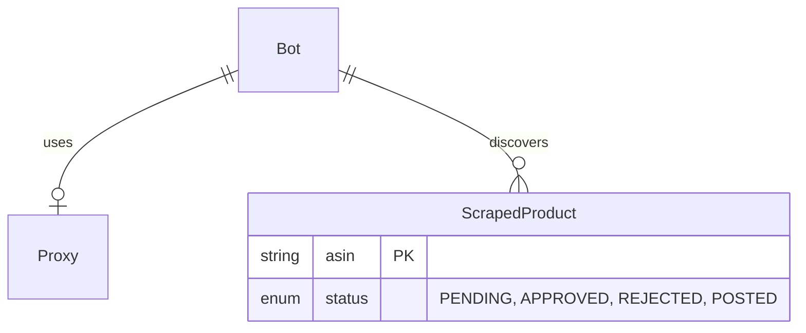

# Data Model

**Branch**: `001-affiliate-bot-platform` | **Date**: 2026-02-01

## 1. Entity Relationship Diagram (Textual)

## 2. Schema Definitions (Prisma)

### `Bot`
Represents a scraping configuration instance.

| Field | Type | Required | Description |
|-------|------|----------|-------------|
| `id` | UUID | Yes | Primary Key |
| `name` | String | Yes | Friendly name (e.g. "Amazon Deals") |
| `targetUrl` | String | Yes | The Amazon URL to scrape |
| `affiliateTag` | String | Yes | Tag to append (e.g. `mytag-20`) |
| `telegramToken` | String | Yes | Encrypted Bot Token |
| `chatId` | String | Yes | Target Channel ID |
| `scheduleCron` | String | Yes | Cron expression (e.g. `0 */4 * * *`) |
| `status` | Enum | Yes | `ACTIVE`, `PAUSED`, `ERROR` |
| `proxyId` | UUID | Yes | Foreign Key to Proxy |
| `createdAt` | DateTime | Yes | |

### `Proxy`
Represents a proxy server connection.

| Field | Type | Required | Description |
|-------|------|----------|-------------|
| `id` | UUID | Yes | Primary Key |
| `host` | String | Yes | IP or Hostname |
| `port` | Int | Yes | Port number |
| `username` | String | No | Auth user |
| `password` | String | No | Auth pass (Encrypted) |
| `protocol` | Enum | Yes | `HTTP`, `SOCKS5` (Default: `HTTP`) |
| `status` | Enum | Yes | `ONLINE`, `OFFLINE` |
| `lastChecked` | DateTime | No | Timestamp of last health check |

### `ScrapedProduct`
Represents an item found by a bot.

| Field | Type | Required | Description |
|-------|------|----------|-------------|
| `id` | UUID | Yes | Primary Key |
| `asin` | String | Yes | Amazon Standard Identification Number (Unique) |
| `title` | String | Yes | Product Title |
| `currentPrice` | Float | Yes | Price at time of scrape |
| `originalPrice` | Float | Yes | MSRP or Strike-through price |
| `discountPercentage` | Int | Yes | Calculated discount |
| `imageUrl` | String | Yes | Main product image |
| `productUrl` | String | Yes | Clean URL (no tag yet) |
| `status` | Enum | Yes | `PENDING_APPROVAL`, `APPROVED`, `REJECTED`, `POSTED` |
| `botId` | UUID | No | Traceability to origin bot |
| `foundAt` | DateTime | Yes | Scrape timestamp |
| `expiresAt` | DateTime | No | For Auto-Reject (12h rule) |

### `SystemSetting`
Global configuration.

| Field | Type | Required | Description |
|-------|------|----------|-------------|
| `key` | String | Yes | PK (e.g., `ADMIN_PASSWORD_HASH`) |
| `value` | String | Yes | Value |

## 3. Enums

- **BotStatus**: `ACTIVE`, `PAUSED`, `ERROR`
- **ProductStatus**: `PENDING_APPROVAL` (High discount), `APPROVED` (Manual), `REJECTED` (Manual/Timeout), `POSTED` (Sent to Telegram)
- **ProxyProtocol**: `HTTP`, `HTTPS`, `SOCKS5`
